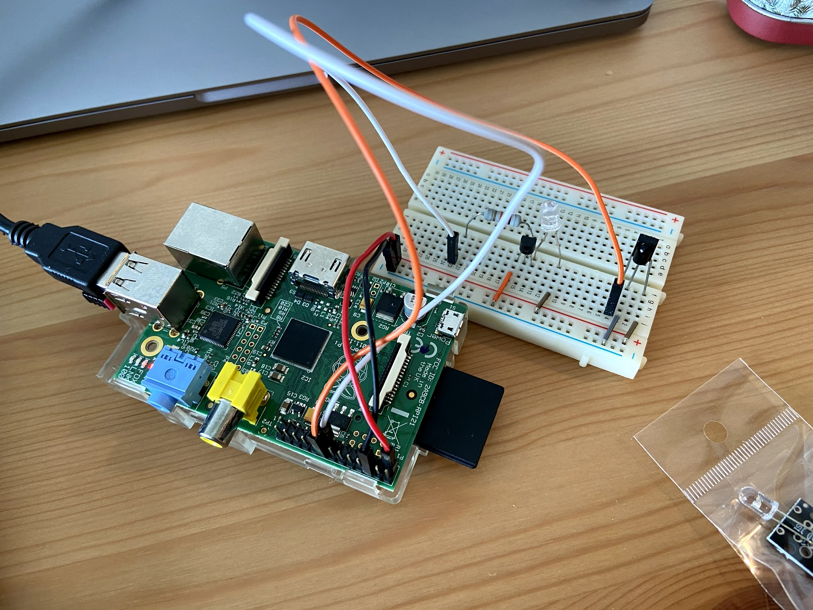
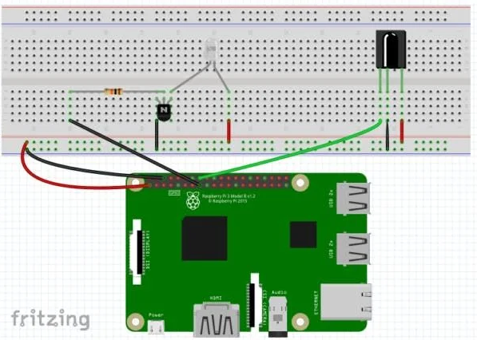
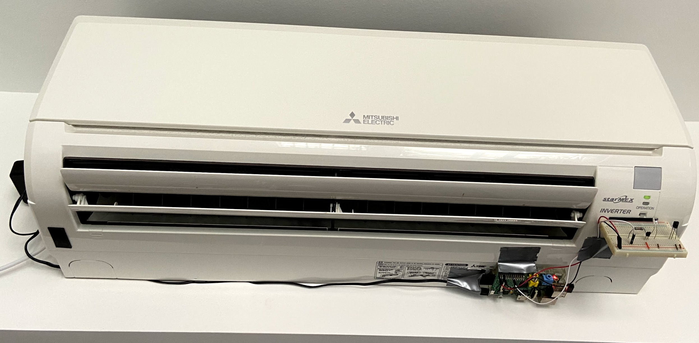

# rpi-ac-control

Contains source code to build the `rpi-ac-control` Debian package, which installs an Mitsubishi AC control tool
on the Raspberry Pi which is exposed locally via Flask and in the Internet via ngrok.

## Prerequisites

In order to function, it is expected that you have 

* A) bought the right hardware
* B) configured a IR emitter on your Raspberry Pi
* C) configured the Raspberry Pi properly

### A) the right hardware

You need the following hardware:

* A Raspberry Pi (any model will do; I used a Raspberry Pi 2 Model B), installed with Raspbian (Buster Lite))
* IR Emitter (e.g. 940nm IR LED 40deg - 40 degree viewing angle. Bright and tuned to 940nm wavelength)
* IR Receiver (e.g. 38khz IR Receiver - Receives IR signals at remote control frequencies)
* Transistor (e.g. PN2222 Transistor - Transistor to help drive IR LED)
* Resistor (10k Ohm resistor - Resistor that goes between RPI GPIO and the PN2222 transistor)
* Breadboard for wiring
* M-F jumper cables

### B) IR emitter setup / circuit

The IR emitter should be connected to the Raspberry Pi like that:



For the circuit, refer to the following explanation:

> Although you can connect an IR LED directly to GPIO pins on the Raspberry Pi, the LED's output signal will be too weak, and the IR transmitter will have a very limited range. A simple transistor circuit solves the problem by amplifying the current output from a pin and thus increasing the IR LED's signal strength. First place your IR LED on the breadboard and wire the long leg(Anode) to 3.3 volts(pin 1) and the long leg(Cathode) to the Emitter of your transistor. Next, run a wire from ground(pin 6) to the collector of your transistor and then use a 10K resistor to connect the base of your transistor to pin 22. </br> </br>
First place your IR LED on the breadboard and wire the long leg (Anode) to 3.3 volts (pin 1) and the long leg (Cathode) to the Emitter of your transistor. Next, run a wire from ground (pin 6) to the collector of your transistor and then use a 10K resistor to connect the base of your transistor to pin 22. Next, place your IR receiver on the breadboard. Run 3.3 Volts to its right leg and connect its center leg to ground. Finally connect pin 23 to the left leg of your IR receiver. 

### C) Raspberry Pi configuration

Add the following lines to `/boot/config.txt` at the end of the file (order is important)

``` 
dtoverlay=gpio-ir-tx,gpio_pin=22 # input
dtoverlay=gpio-ir,gpio_pin=23 # output
```

Install lirc via 

``` 
sudo apt install lirc
```

Reboot

``` 
sudo reboot
```

Verify receiving of signals

``` 
pi@rpi2:~ $ mode2 -d /dev/lirc0
Using driver default on device /dev/lirc0
Trying device: /dev/lirc0
Using device: /dev/lirc0
# click
pulse 498
space 345
pulse 440
```

Verify sending of signals

``` 
irdb-get download streamzap/streamzap.lircd.conf 
cp streamzap.lircd.conf /etc/lirc/lircd.conf.d/
sudo systemctl restart lircd
irsend list Streamzap_PC_Remote KEY_0
irsend send_once Streamzap_PC_Remote KEY_0 # -> check with phone camera, red light should appear
```

Hint: Seems like input pin does not work anymore when output pin is activated in `/boot/config.txt`.
Means you cannot receive and emit signals at the same time.

## How to install & setup the package

Install directly on your Raspberry Pi via

    make install

or

	./create_deb.sh
	sudo gdebi dist/rpi-ac-control_1.0.0_all.deb

## How to use the AC control

Once the service is started, you can control your AC by calling the following endpoints:

	http://<ip-address>:5000/turnOn # or turnon
	http://<ip-address>:5000/turnOff # or turnoff
	http://<ip-address>:5000/custom?temperature=<18-30>&fan=<Silent|Speed1|Speed2|Speed3>

Example via curl:

	curl -f http://<ip-address>:5000/turnOn

## How to monitor / debug service

To verify the functionality of the service, check

	sudo systemctl status ac-control.service

Log data is created in `/var/log/ac-control/`

## How to test

After installation, run the following pytest for integration tests

    make run_tests

## How to expose to Internet

Having local control is nice (e.g. for iOS Shortcuts) but it does not work with Google Home or when not being at home.
Thus, exposing of the server to the Internet is needed. Here an example for how to use `ngrok` for that:

1) Create ngrok account on https://dashboard.ngrok.com/get-started/setup
2) Modify `/opt/ngrok/ngrok.yml` and add your `authtoken` according to your account
3) Restart ngrok service via `sudo systemctl restart ngrok` and verify via `sudo systemctl status ngrok` that it is running
4) Figure out public URL for ngrok service via
	* ngrok website (https://dashboard.ngrok.com/status/tunnels)
	* by executing `curl --silent http://127.0.0.1:4040/api/tunnels | jq '.tunnels[] | select(.name == "http") | .public_url'`
	* by requesting http://<ip-address>:5000/getNgrokUrl in the home network
5) Verify that the service is accessible from Internet by accessing https://223c42a91764.ngrok.io/version

Now you can add e.g. an IFTTT or an iOS shortcut which controls your AC from Google Home or from outside.

## TODOs

* [] improve logging of hvac_ircontrol (currently suppressed)
* [] add more endpoints (to control more AC features)

## 3rd party libraries

* IR kernel drivers & tools -> https://www.lirc.org/html/lircd.html
* amazing code to emit IR signals for Mitsubishi AC -> https://github.com/Ericmas001/HVAC-IR-Control
* library for running local server on Raspberry Pi -> https://flask-restful.readthedocs.io

## Sources

Following links were used for inspiration:

* for general steps -> https://www.hackster.io/austin-stanton/creating-a-raspberry-pi-universal-remote-with-lirc-2fd581
* for general steps -> https://trybotics.com/project/Zero-to-Air-Conditioner-Controller-With-Raspberry--77625
* for Mitsubishi AC signal decoding -> https://www.analysir.com/blog/2015/01/06/reverse-engineering-mitsubishi-ac-infrared-protocol/
* for general signal decoding -> http://absurdlycertain.blogspot.com/2013_03_01_archive.html
* for general signal decoding -> https://github.com/tpudlik/RaspAC
* ngrok documentation -> https://ngrok.com/docs
